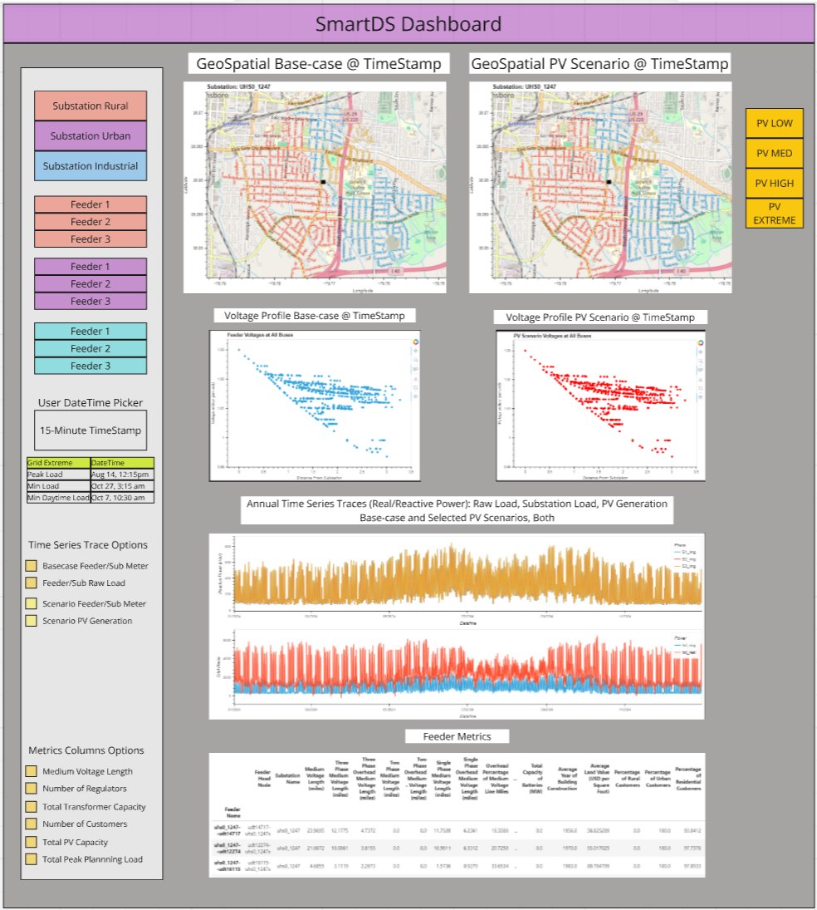
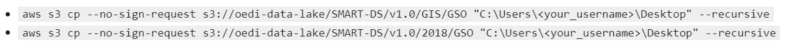
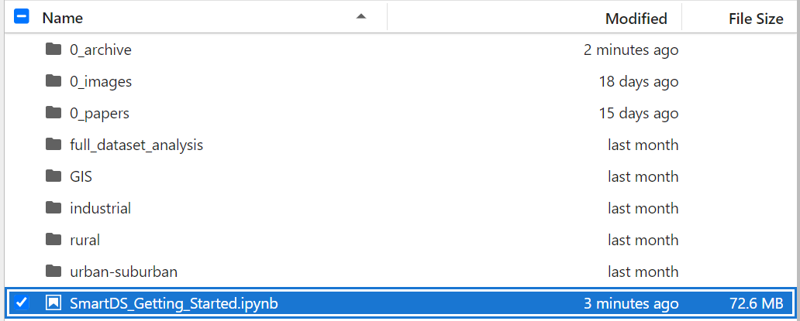

This project seeks to popularize the SmartDS synthetic grid dataset by creating a user tutorial (via [Jupyter Notebook](https://jupyter.org/)) and simple-to-use dashboard (via [Panel](https://panel.holoviz.org/)) that looks something like this:

 

With some Python coding, some data science and some understanding of the distribution system, SmartDS makes the grid accessible and transparent. It can and should become a core resource to those working to understand, analyze and integrate distributed energy resources. 

**Table of Contents**
- [SmartDS Download](#smartds-download)
- [Project Tools](#project-tools)
- [SmartDS Tutorial](#smartds-tutorial)
- [SmartDS Dashboard](#smartds-dashboard)

# SmartDS Documentation and Download
Check out the SmartDS documenation and other publicly available materials for background on SmartDS:
- [Smart DS Documentation](https://github.com/openEDI/documentation/tree/main/SMART-DS)
- [Validation of Synthetic U.S. Electric Power Distribution System Data Sets in IEEE Transactions on Smart Grid](https://ieeexplore.ieee.org/document/9043892)

### Downloads
- SMARTDS datasets are available at multiple locations. The [Open Energy Data Initiative](https://data.openei.org/submissions/2981) is used here.
- Start by downloading the [AWS Command Line Interface](https://aws.amazon.com/cli/) 

We focus on the most current 2018 dataset for the *full* GSO (Greensboro, NC) region. The download will take several minutes. Download the **entire GSO region**, along with the appropriate GIS files, using the following commands:

Place the downloaded folders (urban-suburban, rural, industrial, GIS, full dataset analysis) alongside the 'SmartDS Getting Started Notebook' as shown:

     

# Project Tools
- **Opendssdirect** This project runs [OpenDSS](https://www.epri.com/pages/sa/opendss) simulation files using the [opendssdirect](https://dss-extensions.org/OpenDSSDirect.py/index.html) Python interface. An extensive knowledge of OpenDSS and electrical engineering is not required.
- **Holoviz** Both the tutorial and dashboard use [Holoviz tools](https://holoviz.org/index.html) extensively. HvPlot, Holoviews, Geoviews and Panel are the core visualization tools that build primarily on pandas and geopandas.

# SmartDS Tutorial
The goals for the SmartDS tutorial are to:
- Demonstrate the SmartDS architecture and directory navigation
- Demonstrate the use of the geospatial files included (Shapefiles and GeoJSON)
- Demonstrate the OpenDSS simulation process for snapsot and time-series analysis
- Demonstrate how the loads and PV Systems datasets are implemented in the simulation process

# SmartDS Dashboard
The goals for the SmartDS dashboard are:
- To provide an easy and fast avenue to access the SmartDS datasets without any coding and minimal downloads
- To provide visualization of SmartDS' PV Scenarios (low, medium, high, extreme)
- To provide a means to compare scenarios for both snapshot and time-series views
- To highlight pertenant metrics and voltage and current impacts

### Caution 
- Due to changes to  made since the publishing of SmartDS, changes need to be made to SmartDS `PVSystems.dss` files prior to PV scenario simulations. A `PVSystems.dss` file is included in every scenario for every substation feeder. Use find/replace in lieu of a custom script:
  - VV_RefReactivePower --> RefReactivePower
  - kvarlimit --> kvarmax

